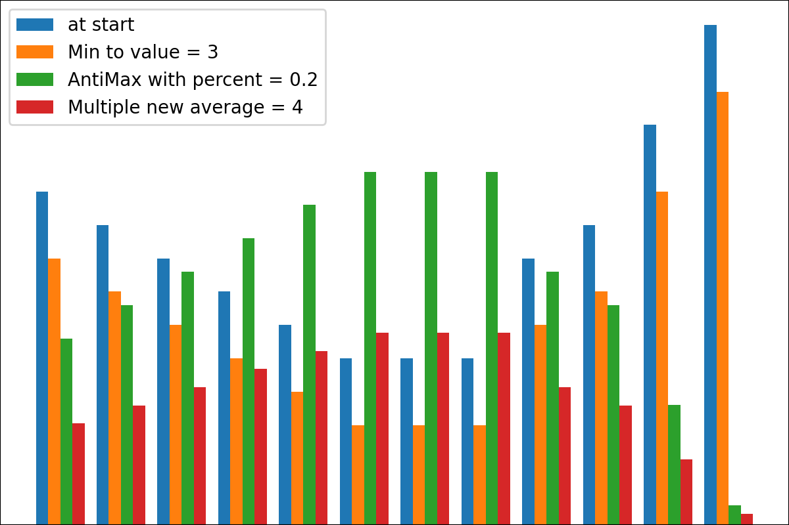
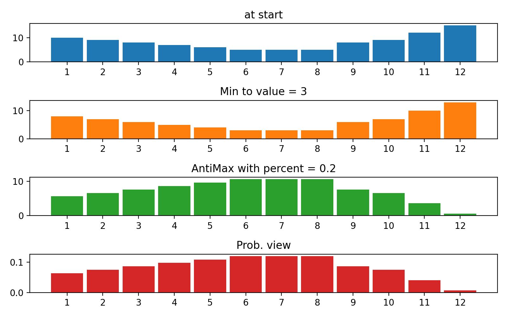

[](https://pypi.org/project/cost2fitness/)
[](https://pepy.tech/project/cost2fitness)
[](https://pepy.tech/project/cost2fitness)
[](https://pepy.tech/project/cost2fitness)

# cost2fitness

PyPI package for conversion cost values (less is better) to fitness values (more is better) and vice versa

```
pip install cost2fitness
```

- [cost2fitness](#cost2fitness)
  - [About](#about)
  - [Transformers](#transformers)
  - [Pipeline of transformers](#pipeline-of-transformers)
  - [How to plot](#how-to-plot)
  - [Examples with plotting](#examples-with-plotting)
    - [Each transformer](#each-transformer)
    - [Pipeline](#pipeline)
  - [Neural net tools](#neural-net-tools)
    - [Layers](#layers)
    - [Helpers](#helpers)
    - [Examples](#examples)

## About

This is the package containing several methods for transformation numpy arrays depended on scales, averages and so on. But the primary way to use it is the conversion from cost values (less is better) to fitness values (more is better) and vice versa. It can be highly helpful when u r using 

* evolutionary algorithms depended on numeric differences: so, it's important to set good representation of samples scores for better selection
* sampling methods with probabilities depended on samples scores 

## Transformers

There are several simple transformers. Each transformer is the subclass of `BaseTransformer` class containing `name` field and `transform(array)` method which transforms input array to new representation. 

Checklist:

* `ReverseByAverage`, 
* `AntiMax`, 
* `AntiMaxPercent(percent)`, 
* `Min2Zero`, 
* `Min2Value(value)`, 
* `ProbabilityView` (converts data to probabilities), 
* `SimplestReverse`, 
* `AlwaysOnes` (returns array of ones), 
* `NewAvgByMult(new_average)`,
* `NewAvgByShift(new_average)`
* `Divider(divider_number_or_array)` (divides array on number or array, useful for fixed start normalization)
* `Argmax` (returns position of maximum element in array)

U can create your transformer using simple logic from [file](cost2fitness/transformers.py).

```python
import numpy as np 

from cost2fitness import Min2Zero

tf = Min2Zero()

arr_of_scores = np.array([10, 8, 7, 5, 8, 9, 20, 12, 6, 18])

tf.transform(arr_of_scores)
# array([ 5,  3,  2,  0,  3,  4, 15,  7,  1, 13])
```

## Pipeline of transformers

U also can combine these transformers using `Pl` pipeline. For example:

```python
import numpy as np 

from cost2fitness import ReverseByAverage, AntiMax, Min2Zero, Pl

pipe = Pl([
        Min2Zero(),
        ReverseByAverage(),
        AntiMax()        
        ])


arr_of_scores = np.array([10, 8, 7, 5, 8, 9])


# return each result of pipeline transformation (with input)
pipe.transform(arr_of_scores, return_all_steps= True)
#array([[10.        ,  8.        ,  7.        ,  5.        ,  8.        ,
#         9.        ],
#       [ 5.        ,  3.        ,  2.        ,  0.        ,  3.        ,
#         4.        ],
#       [ 0.66666667,  2.66666667,  3.66666667,  5.66666667,  2.66666667,
#         1.66666667],
#       [ 5.        ,  3.        ,  2.        ,  0.        ,  3.        ,
#         4.        ]])

# return only result of transformation
pipe.transform(arr_of_scores, return_all_steps= False)
#array([5., 3., 2., 0., 3., 4.])

```

## How to plot

There is `plot_scores` function for plotting transformation process results. It has arguments:

* `scores` : 2D numpy array
       2D numpy array with structure `[start_values, first_transform(start_values), second_transform(first_transform), ...]`, where each object is 1D-array of scores (values/costs/fitnesses).
* `names` : `None`/string list, optional
        Names for each step for plot labels. The default is `None`.
* `kind` : str, optional
        for **'beside'** each new column will be beside previous; for **'under'** there will be new plot under previous. The default is 'beside'.
* `save_as` : `None`/str, optional
        File path to save the plot. The default is `None`.

## Examples with plotting

### Each transformer

[Code](tests/tf_for_readme.py)


### Pipeline
[Code](tests/simple_pipe.py)





## Neural net tools

I have made basic neural network tools here because it's very necessary to use simple networks with some **reinforcement learning** tasks, but common packages like [Keras](https://keras.io) work extremely slow if u need just prediction (forward propagation) only for 1 sample but many times. So it will be faster to use simple numpy-based packages for these cases.


### Layers

It was not so difficult to use this transformers logic for creating neural networks. So this package has next neural network layers as transformers:

* **Activations**:
  * `Softmax`
  * `Relu`
  * `Sigmoid`
  * `Tanh`

* **Dense layers tools**:
  * `Bias(bias_len, bias_array = None)` -- to add bias with length `bias_len`. If `bias_array` is `None`, uses random bias
  * `MatrixDot(from_size, to_size, matrix_array = None)`
  * `NNStep(from_size, to_size, matrix_array = None, bias_array = None)` -- it's `MatrixDot` and `Bias` together, if u wanna create them faster

### Helpers

And there are several helpers methods for using `pipeline` object like neural network (only for **forward propagation** of course):

* **`pipeline` objects methods**:
  * `get_shapes()` -- to get list of shapes of needed array for NN
  * `total_weights()` -- get count of weights for overall NN
  * `set_weights(weights)` - set weights (as list of arrays with needed shapes) for NN

* **Alone functions**:
  * `arr_to_weigths(arr, shapes)` -- converts 1D-array `arr` to list of arrays with shapes `shapes` to put it in `set_weights` method

### Examples

See [simplest example](tests/compare_NN.py)


